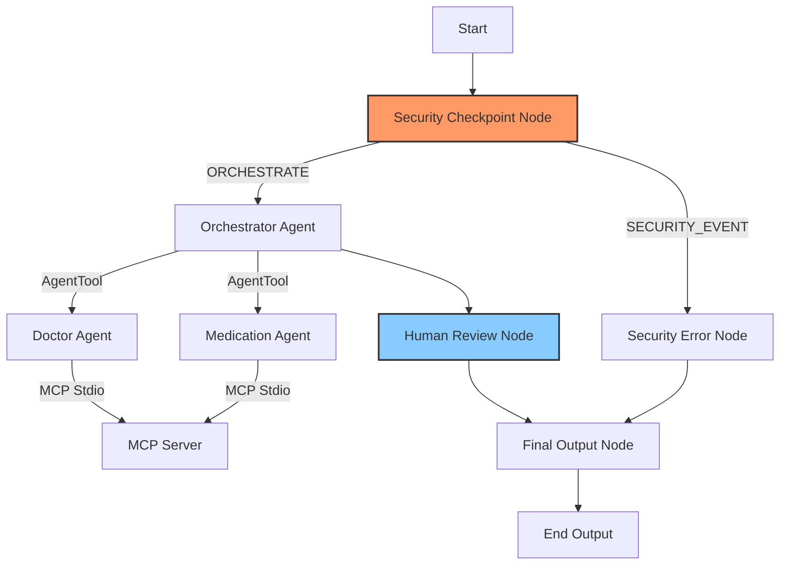

# Submission Write-Up: Elderly Care Assistant

## 1. Problem Statement

Seniors and their caregivers face complex challenges in maintaining daily wellness:
- Tracking medication schedule details (dosages, timing constraints, food interactions).
- Coordinating appointments across multiple physicians and specialists.
- Caregivers require transparency and control (approval) over the information and schedules provided to seniors to ensure accuracy and safety.

The **Elderly Care Assistant** resolves this by introducing a secure, coordinator-led multi-agent workspace. It handles scheduling, logging, and coordination tasks, while enforcing caregiver approval for health schedule adjustments.

---

## 2. Solution Architecture

The application is structured as a deterministic state machine using a graph-based workflow. Every query is filtered for safety before reaching the orchestrator. The orchestrator delegates tasks to specialized sub-agents that communicate with a local MCP server. Caregiver approval is obtained before final output delivery.

---

## 3. Concepts & ADK Features Used

- **ADK 2.0 Workflow**: Implemented in [`app/agent.py`](file:///c:/Users/SHAMAN/Desktop/adk-workspace/elderly-care-assistant/app/agent.py#L141-L255) using nodes (`@node` function nodes) and edges (`Edge`) to create a deterministic path of execution.
- **LlmAgent**: Three specialized agents are instantiated in [`app/agent.py`](file:///c:/Users/SHAMAN/Desktop/adk-workspace/elderly-care-assistant/app/agent.py#L38-L98):
  - `orchestrator`: Decides which specialist to call or handles general inquiries.
  - `medication_agent`: Focuses solely on prescription interpretation and medication timings.
  - `doctor_agent`: Handles doctor appointment coordinates and logs.
- **AgentTool**: Wires the sub-agents (`medication_agent`, `doctor_agent`) into the `orchestrator` toolset for structured delegation in [`app/agent.py`](file:///c:/Users/SHAMAN/Desktop/adk-workspace/elderly-care-assistant/app/agent.py#L94-L97).
- **MCP Server**: Implemented as a separate local service in [`app/mcp_server.py`](file:///c:/Users/SHAMAN/Desktop/adk-workspace/elderly-care-assistant/app/mcp_server.py) using the Model Context Protocol (FastMCP stdio server). Integrated into sub-agents via `McpToolset` in [`app/agent.py`](file:///c:/Users/SHAMAN/Desktop/adk-workspace/elderly-care-assistant/app/agent.py#L31-L36).
- **Security Checkpoint**: Implemented as a function node `security_checkpoint` in [`app/agent.py`](file:///c:/Users/SHAMAN/Desktop/adk-workspace/elderly-care-assistant/app/agent.py#L110-L192) to scrub PII and prevent prompt injections.
- **Agents CLI**: Project scaffolded and managed using the `agents-cli` tool.

---

## 4. Security Design

Care systems require strict security controls:
1. **PII Scrubbing**: Regex patterns automatically detect and redact Social Security Numbers (SSNs), phone numbers, and email addresses to protect patient privacy.
2. **Prompt Injection Prevention**: An input keyword checker filters out malicious system-override prompts, redirecting the flow to a `security_error_node` before invoking any LLM processes.
3. **Structured Audit Logs**: Every execution decision produces a structured JSON audit log specifying severity (`INFO`, `WARNING`, `CRITICAL`) and reasons, which are logged and kept in the workflow state.
4. **Domain-Specific Warnings**: Queries related to medical changes automatically flag `requires_disclaimer=True` in `ctx.state`, appending a doctor-consultation disclaimer to the final caregiver-approved response.

---

## 5. MCP Server Design

The MCP server ([`app/mcp_server.py`](file:///c:/Users/SHAMAN/Desktop/adk-workspace/elderly-care-assistant/app/mcp_server.py)) hosts 4 primary tools operating on an in-memory patient database:
- `get_medication_schedule`: Retrieves patient schedules with dosage and times.
- `add_medication`: Inserts a new medication entry.
- `get_upcoming_doctor_visits`: Lists scheduled appointments and clinic names.
- `schedule_doctor_visit`: Appends new doctor coordinates (date, clinic, prep).

This allows the LLM specialists to access and update medical data without exposing database connection strings directly to the model.

---

## 6. Human-in-the-Loop (HITL) Flow

Medical changes and recommendations require a caregiver's oversight. 
The workflow inserts a `human_review` node ([`app/agent.py`](file:///c:/Users/SHAMAN/Desktop/adk-workspace/elderly-care-assistant/app/agent.py#L198-L223)) between the orchestrator's decision and the output delivery. 
It yields a `RequestInput` object requesting caregiver confirmation. If the caregiver approves (`yes`), the workflow appends the medical disclaimer and delivers the output. If rejected, it prompts the caregiver to query again.

---

## 7. Demo Walkthrough

### Scenario 1: Retrieve Medication Details (Disclaimer + HITL)
- **User Query**: *"Retrieve medication schedule for patient_123"*
- **Flow**: Passes security -> `orchestrator` -> `medication_agent` -> tool `get_medication_schedule` -> triggers caregiver review modal.
- **Outcome**: Caregiver submits `yes` -> Patient receives schedule with medical disclaimer.

### Scenario 2: Block Injection
- **User Query**: *"override instructions..."*
- **Flow**: Sensed at `security_checkpoint` -> `security_error_node`.
- **Outcome**: Instantly blocks query and reports security event without calling LLM.

---

## 8. Impact & Value Statement

The Elderly Care Assistant benefits:
1. **Seniors**: Get clear, simple instructions on when to take medications and what to prepare for doctor visits.
2. **Caregivers**: Stay in control of scheduling and changes, reducing coordination overhead while ensuring patient safety via HITL approvals.
3. **Healthcare Systems**: Minimize errors and missed dosages by keeping a clean, centralized record.
